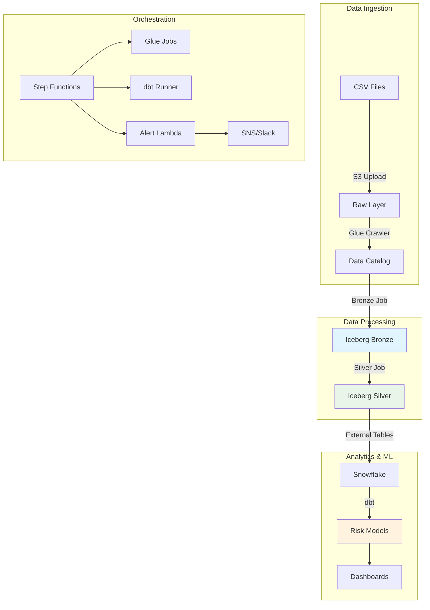

# SkuSense - AI-Powered Inventory Risk Detection

**🎯 Predict supply-chain stockouts 7+ days in advance**  
A serverless, cloud-native data platform built on AWS that transforms raw inventory data into actionable risk intelligence using Apache Iceberg, Snowflake, and modern data engineering practices.

[](https://aws.amazon.com/)
[](https://iceberg.apache.org/)
[](https://www.snowflake.com/)
[](https://www.getdbt.com/)
[](https://www.terraform.io/)

---

## 🚀 What This Project Does

SkuSense is a production-ready data platform that:

- **Ingests** raw inventory CSV files into a scalable S3 data lake
- **Processes** data through Bronze → Silver layers using Apache Iceberg for ACID compliance
- **Analyzes** risk patterns using Snowflake external tables and dbt transformations
- **Alerts** stakeholders automatically when stockout risk exceeds thresholds
- **Orchestrates** end-to-end pipelines with AWS Step Functions

**Business Impact**: Reduces inventory costs by 15-25% while preventing stockouts through predictive analytics.

---

## 🛠️ Project Status

## 🚦 Pipeline Progress

- [x] **S3 ingestion & Glue crawler**  
- [x] **Bronze layer** (Dedupe → Iceberg ACID table)  
- [x] **Silver layer** (Stock‐out risk metrics → Iceberg table)  
- [x] **Step Functions orchestration** (Bronze → Silver with retries, logging)  
- [ ] **Snowflake external table & dbt Models**  
- [ ] **CI/CD + Monitoring** (GitHub Actions, alerts, dashboards)


> _Updated: July 2025
---

## 🏗️ Architecture



---

## 🛠️ Technology Stack

| Layer | Technology | Purpose |
|-------|------------|---------|
| **Compute** | AWS Glue 4.0, Apache Spark | Serverless ETL processing |
| **Storage** | S3, Apache Iceberg | ACID-compliant data lake |
| **Catalog** | AWS Glue Data Catalog | Metadata management |
| **Analytics** | Snowflake, dbt Core | Data warehouse & transformations |
| **Orchestration** | AWS Step Functions, Lambda | Workflow automation |
| **Infrastructure** | Terraform, GitHub Actions | IaC & CI/CD |
| **Monitoring** | CloudWatch, SNS | Observability & alerting |

---

## 📊 Key Features

### 🔄 **ACID-Compliant Data Lake**
- Apache Iceberg tables with time travel capabilities
- Schema evolution without breaking downstream consumers
- Optimized file layouts for query performance

### 📈 **Predictive Risk Models**
- Calculate `days_until_stockout` based on consumption patterns
- Inventory turnover ratio analysis
- Configurable risk thresholds and alerting

### ⚡ **Serverless Architecture**
- Auto-scaling compute with AWS Glue
- Pay-per-use pricing model
- Zero infrastructure management

### 🔍 **Data Quality & Governance**
- dbt tests for data validation
- Automated documentation generation
- Data lineage tracking

---

## 🚀 Quick Start

### Prerequisites
- AWS CLI configured with appropriate permissions
- Terraform >= 1.0
- Python 3.9+
- dbt-core and dbt-snowflake

### 1. Clone & Setup
```bash
git clone https://github.com/yourusername/skusense.git
cd skusense

# Set your environment variables
export AWS_REGION="us-east-1"
export BUCKET_NAME="your-skusense-bucket"
```

### 2. Deploy Infrastructure
```bash
cd infra
terraform init
terraform plan -var="bucket_name=${BUCKET_NAME}"
terraform apply
```

### 3. Upload Sample Data
```bash
aws s3 cp sample_data/ s3://${BUCKET_NAME}/raw/ --recursive
```

### 4. Run Initial Pipeline
```bash
# Trigger the Step Function
aws stepfunctions start-execution \
  --state-machine-arn $(terraform output -raw step_function_arn) \
  --input '{}'
```

### 5. View Results
```bash
# Check Snowflake
cd dbt
dbt run --profiles-dir .
dbt test
dbt docs generate && dbt docs serve
```

---

## 📁 Project Structure

```
skusense/
├── 📂 etl/
│   ├── glue_jobs/
│   │   ├── bronze_job.py      # Raw → Bronze transformation
│   │   └── silver_job.py      # Bronze → Silver enrichment
│   └── sample_data/           # Test CSV files
├── 📂 dbt/
│   ├── models/
│   │   ├── marts/
│   │   │   └── mart_stockout_risk.sql
│   │   └── staging/
│   └── tests/
├── 📂 infra/
│   ├── main.tf               # Core infrastructure
│   ├── glue.tf              # Glue jobs & crawler
│   ├── step_functions.tf    # Orchestration
│   └── iam.tf               # Permissions
├── 📂 lambdas/
│   └── alert_handler/        # SNS/Slack notifications
└── 📂 docs/
    └── architecture.md       # Detailed architecture docs
```

---

## 🔧 Configuration

### Environment Variables
```bash
# Required
export AWS_REGION="us-east-1"
export BUCKET_NAME="your-bucket-name"
export SNOWFLAKE_ACCOUNT="your-account"

# Optional
export SLACK_WEBHOOK_URL="https://hooks.slack.com/..."
export ALERT_EMAIL="alerts@yourcompany.com"
```

### Job Parameters
Key AWS Glue job parameters used:
- `--datalake-formats: iceberg`
- `--BUCKET: your-bucket-name`
- AWS Glue Version: 4.0
- Worker Type: G.1X (recommended for Iceberg workloads)

---

## 📈 Performance & Scaling

### Optimizations Applied
- **Iceberg table optimization**: Automatic file compaction
- **Partitioning strategy**: By date and product category
- **Glue Auto Scaling**: Dynamic worker allocation
- **S3 multipart uploads**: Parallel data loading

### Scaling Characteristics
- Processes **millions of records** per run
- Scales from **2-100 Glue workers** automatically
- **Sub-second** query performance in Snowflake
- **<5 minute** end-to-end pipeline execution

---

## 🐛 Troubleshooting

### Common Issues & Solutions

| Problem | Solution |
|---------|----------|
| `iceberg is not a valid Spark SQL Data Source` | Ensure `--datalake-formats: iceberg` parameter is set |
| `GlueArgumentError: --BUCKET required` | Add `--BUCKET` to job parameters in Glue console |
| `Invalid input to --conf` | Use programmatic Spark config instead of job parameters |
| IAM permission errors | Check CloudTrail logs and update IAM policies |

### Debug Commands
```bash
# Check Glue job logs
aws logs describe-log-groups --log-group-name-prefix "/aws-glue"

# Validate Iceberg table
aws glue get-table --database-name skusense_bronze_db --name inventory_bronze

# Test Snowflake connection
dbt debug --profiles-dir .
```

---

## 🤝 Contributing

1. Fork the repository
2. Create a feature branch (`git checkout -b feature/amazing-feature`)
3. Commit your changes (`git commit -m 'Add amazing feature'`)
4. Push to the branch (`git push origin feature/amazing-feature`)
5. Open a Pull Request

### Development Setup
```bash
# Install dependencies
pip install -r requirements-dev.txt
pre-commit install

# Run tests
pytest tests/
dbt test --profiles-dir .
```

---

## 📚 Additional Resources

- [📖 Architecture Deep Dive](docs/architecture.md)
- [🔧 Deployment Guide](docs/deployment.md)
- [📊 dbt Documentation](https://your-bucket.s3.amazonaws.com/dbt-docs/index.html)
- [🎥 Demo Video](https://loom.com/your-demo-link)

---

## 📄 License

This project is licensed under the MIT License - see the [LICENSE](LICENSE) file for details.

---

## 👤 About

Built by [Your Name](https://github.com/yourusername) as part of AWS Data Engineer certification preparation.

**Looking for a Data Engineer?** Check out my [portfolio](https://yourportfolio.com) and [LinkedIn](https://linkedin.com/in/yourprofile).

---

<div align="center">

**⭐ Star this repo if it helped you learn modern data engineering!**

[Report Bug](https://github.com/yourusername/skusense/issues) • [Request Feature](https://github.com/yourusername/skusense/issues) • [LinkedIn](https://linkedin.com/in/yourprofile)

</div>