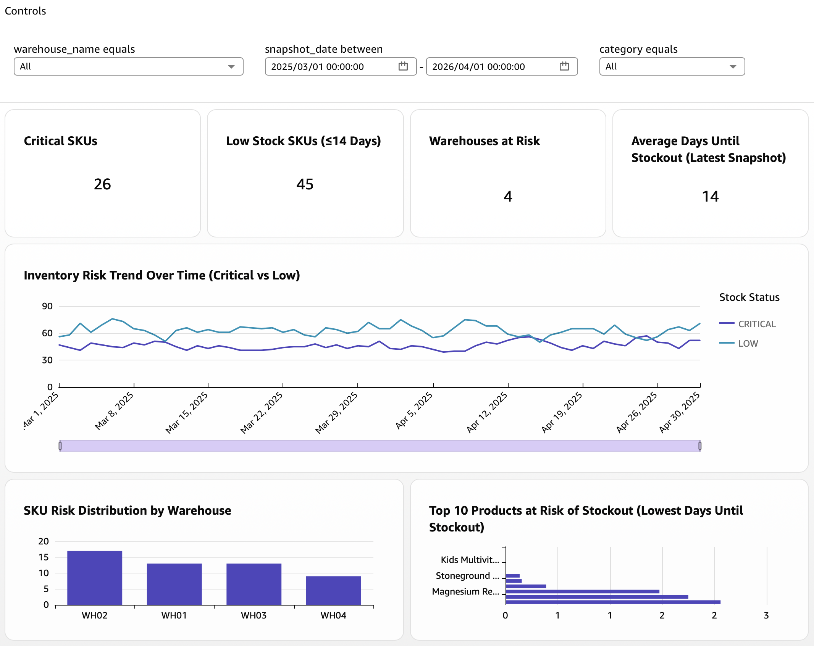
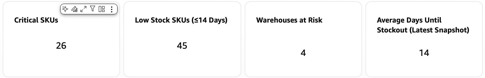
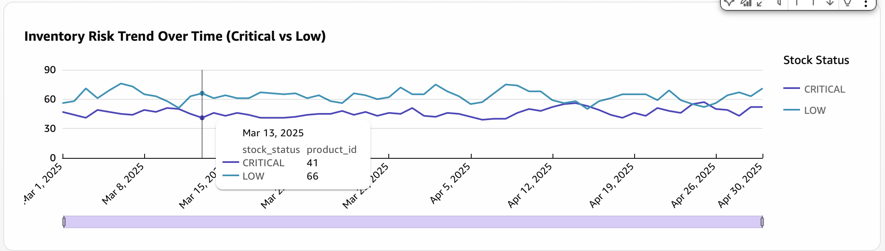
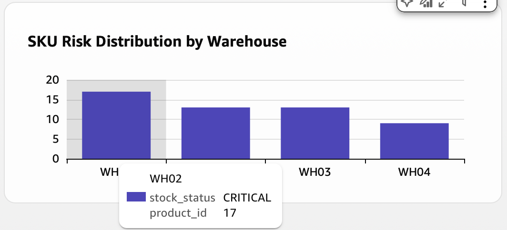
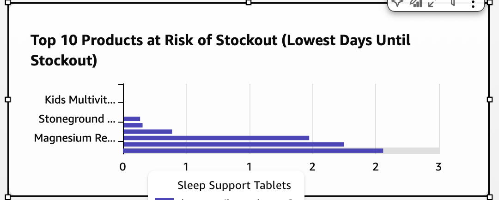

# SkuSense - Inventory Risk Analytics Platform (AWS-Native)

Identify stockout risk across warehouses using a fully serverless data platform

An end-to-end AWS-native analytics system that transforms raw inventory snapshots into warehouse-level stockout risk insights, modeled using dbt and visualized through a QuickSight dashboard.

## 🎯 Problem
Inventory stockouts lead to:
	-	Lost revenue
	-   Poor customer experience
	-   Inefficient replenishment decisions

Most systems track inventory levels but fail to:
	-	Model risk over time
	-	Identify which products need immediate action
	-	Provide warehouse-level visibility

---
## 💡 Solution

SkuSense models inventory as a time-series warehouse dataset, enabling:
	-	Tracking of stockout risk trends over time
	-	Identification of critical and low-stock SKUs
	-	Prioritization of high-risk products
	-	Comparison of risk across warehouses
---

## 🏗️ Architecture (AWS-Native)
### Pipeline Flow

1. **Ingestion**
   - Raw CSV inventory snapshots uploaded to S3

2. **Processing (Glue + Iceberg)**
   - Bronze: cleaned + deduplicated data  
   - Silver: daily inventory snapshot table  

3. **Warehouse Modeling (dbt + Athena)**
   - Star schema built with:
     - `fct_inventory_risk`
     - `dim_product`
     - `dim_warehouse`
     - `dim_date`
   - Business logic implemented in SQL

4. **Consumption Layer (QuickSight)**
   - Dashboard for inventory risk monitoring

---

## 📊 Data Model

### Fact Table

**`fct_inventory_risk`**

**Grain:**
> One row per `snapshot_date`, `product_id`, `warehouse_id`

**Key Metrics:**
- `qty_on_hand`
- `inventory_delta`
- `daily_units_sold_proxy`
- `avg_daily_usage_7d`
- `days_until_stockout`
- `stock_status`
- `reorder_flag`

---

### Dimensions

- `dim_product`
- `dim_warehouse`
- `dim_date`

---

## 📈 Key Metrics

- **Critical SKUs** → products with ≤ 7 days until stockout  
- **Low Stock SKUs** → products with ≤ 14 days until stockout  
- **Warehouses with Critical Risk** → warehouses containing at least one critical SKU  
- **Average Days Until Stockout** → average across latest snapshot  

---

## 🔗 Lineage Graph


## 📊 Dashboard (QuickSight)



### KPI Overview



- Critical SKUs
- Low Stock SKUs
- Warehouses at Risk
- Average Days Until Stockout

### Visualizations

- **Risk Trend Over Time**

  - Tracks number of critical and low-stock SKUs daily

- **Warehouse Risk Distribution**

  - Compares inventory risk across warehouses

- **Top Products at Risk**

  - Highlights products with lowest days until stockout

### Filters
- Warehouse  
- Product Category  
- Date Range  

---

## 🧠 Analytics Logic (dbt)

All business logic is implemented in SQL using dbt:

- Window functions (`LAG`, rolling averages)
- Inventory movement classification
- Risk categorization using thresholds
- Derived KPIs for reporting

---

## ✅ Data Quality

Implemented using dbt tests:

- Grain validation (`snapshot_date + product_id + warehouse_id`)
- Non-null constraints
- Relationship tests between fact and dimensions
- Accepted values for stock status
- Non-negative checks for inventory metrics

---

## 🛠️ Technology Stack

| Layer | Technology |
|------|----------|
| Storage | Amazon S3 |
| Processing | AWS Glue (PySpark) |
| Table Format | Apache Iceberg |
| Catalog | AWS Glue Catalog |
| Query Engine | Amazon Athena |
| Transformation | dbt (dbt-athena) |
| BI | Amazon QuickSight |
| Infrastructure | Terraform |

---

## 🚀 How to Run

### 1. Deploy Infrastructure
```bash
cd infra
terraform init
terraform apply
** Upload Data **
aws s3 cp sample_data/ s3://<your-bucket>/raw/ --recursive

** Run Pipeline **
aws stepfunctions start-execution \
  --state-machine-arn <state-machine-arn> \
  --input '{}'

** Build Warehouse Models **
cd dbt
dbt run
dbt test

** Query via Athena/Visualize in QuickSight
```
---
## 📌 Key Learnings
-	Importance of data grain correctness in analytics systems
-	Separation of data processing (Glue) vs business logic (dbt)
-	Building a star schema for BI consumption
-	Implementing data quality checks in analytics pipelines
-	Designing end-to-end analytics workflows on AWS
---
## 🎯 Project Focus
This project demonstrates:
	-	Analytics Engineering (dbt + modeling)
	-	Data Engineering fundamentals (Glue, Iceberg, pipelines)
	-	BI/Reporting (QuickSight dashboard)
	-	End-to-end data product thinking
---
Built By Paruhang Angdembe :)