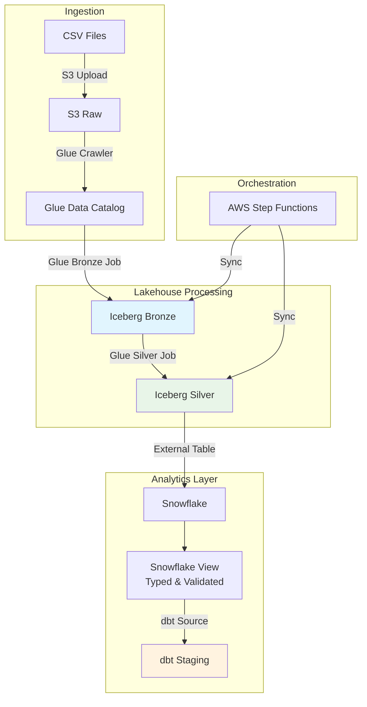

# SkuSense - Inventory Risk Analytics Data Platform

A modern, cloud-native **data engineering and analytics platform** that transforms raw inventory data into structured, analytics-ready risk signals using AWS, Apache Iceberg, Snowflake, and dbt.

**Status:** Active development — Gold layer in progress

[](https://aws.amazon.com/)
[](https://iceberg.apache.org/)
[](https://www.snowflake.com/)
[](https://www.getdbt.com/)
[](https://www.terraform.io/)

---
## 🎯 What This Project Does (Current State)

SkuSense is a production-style **data platform** that:

- Ingests raw inventory CSV data into an Amazon S3 data lake
- Processes data through **Bronze → Silver layers** using **Apache Iceberg** for ACID compliance
- Orchestrates end-to-end pipelines with **AWS Step Functions**
- Exposes curated Silver data to **Snowflake via external tables**
- Applies analytics transformations using **dbt (source → staging)**

The focus of this project is **data modeling, reliability, and analytics readiness**, not just standalone ETL scripts.

---

## 🛠️ Current Project Status

### ✅ Completed

- S3 raw data ingestion
- AWS Glue crawler
- Bronze layer: deduplication → Iceberg ACID table
- Silver layer: inventory risk metrics → Iceberg table
- Step Functions orchestration (Bronze → Silver)
  - retries
  - timeouts
  - CloudWatch logging
- Snowflake storage integration & external stage
- Snowflake external table over Silver Iceberg data
- Snowflake view to flatten VARIANT data into typed columns
- dbt:
  - source definitions
  - source tests
  - staging model (`stg_inventory_silver`) with tests

### 🚧 In Progress (Next)

- dbt **Intermediate models** (business logic & risk classification)
- dbt **Gold marts** (fact & dimension tables)

### ⏳ Planned

- Monitoring & alerting (CloudWatch alarms, SNS)
- CI/CD (GitHub Actions for Terraform + dbt)
- Analytics dashboard (Streamlit or Metabase)
- dbt documentation site

## 🏗️ Architecture
> Note: Gold (intermediate and marts) models are currently under development and are intentionally excluded from the current architecture diagram.


```mermaid
flowchart TB
    subgraph "Ingestion"
        A[CSV Files] -->|S3 Upload| B[S3 Raw]
        B -->|Glue Crawler| C[Glue Data Catalog]
    end

    subgraph "Lakehouse Processing"
        C -->|Glue Bronze Job| D[Iceberg Bronze]
        D -->|Glue Silver Job| E[Iceberg Silver]
    end

    subgraph "Orchestration"
        F[AWS Step Functions] -->|Sync| D
        F -->|Sync| E
    end

    subgraph "Analytics Layer"
        E -->|External Table| G[Snowflake]
        G --> H[Snowflake View<br/>Typed & Validated]
        H -->|dbt Source| I[dbt Staging]
    end

    style D fill:#e1f5fe
    style E fill:#e8f5e8
    style I fill:#fff3e0

```

---

## 🛠️ Technology Stack

| Layer | Technology | Purpose |
|-----|-----------|--------|
| Compute | AWS Glue (Spark) | Serverless data processing |
| Storage | Amazon S3, Apache Iceberg | ACID-compliant data lake |
| Catalog | AWS Glue Data Catalog | Metadata management |
| Orchestration | AWS Step Functions | Workflow orchestration |
| Analytics | Snowflake | Query engine |
| Transformations | dbt Core | Analytics modeling |
| Infrastructure | Terraform | Infrastructure as Code |
| Monitoring | CloudWatch | Logs & observability |

---

## 📊 Metrics Currently Modeled (Silver Layer)

- `product_id`
- `warehouse_id`
- `snapshot_date`
- `qty_on_hand`
- `avg_daily_usage`
- `days_until_stockout`
- `turnover_ratio`
- `reorder_flag`
- `stock_status`

---
## 🚀 Roadmap

### Gold Layer (dbt)
- Intermediate inventory risk modeling
- Fact table: `fct_stockout_risk`
- Dimensions: `dim_product`, `dim_warehouse`
- dbt tests & documentation

### Platform Enhancements
- CI/CD (Terraform + dbt)
- Alerting for critical stockout risk
- Analytics dashboard
---

## 📁 Project Structure

```
skusense/
├── etl/
│ ├── glue_jobs/
│ │ ├── bronze_job.py # Raw → Bronze transformation
│ │ └── silver_job.py # Bronze → Silver enrichment
│ └── sample_data/ # Test CSV files
├── dbt/
│ └── models/
│ ├── staging/
│ │ └── stg_inventory_silver.sql
│ ├── intermediate/ # next: business logic & risk modeling
│ └── marts/ # planned: fact & dimension tables
├── infra/
│ ├── main.tf # Core infrastructure
│ ├── glue.tf # Glue jobs & crawler
│ ├── step_functions.tf # Orchestration
│ └── iam.tf # Permissions
├── lambdas/ # planned: alerting & notifications
└── docs/
└── architecture.md # Architecture documentation
```

---


## 👤 About

Built by [Paruhang Angdembe](https://github.com/Paruhang-Angdembe) as a flagship portfolio project to demonstrate modern
data lakehouse architecture, analytics engineering, and cloud-native orchestration
patterns aligned with AWS Data Engineer roles.
---
