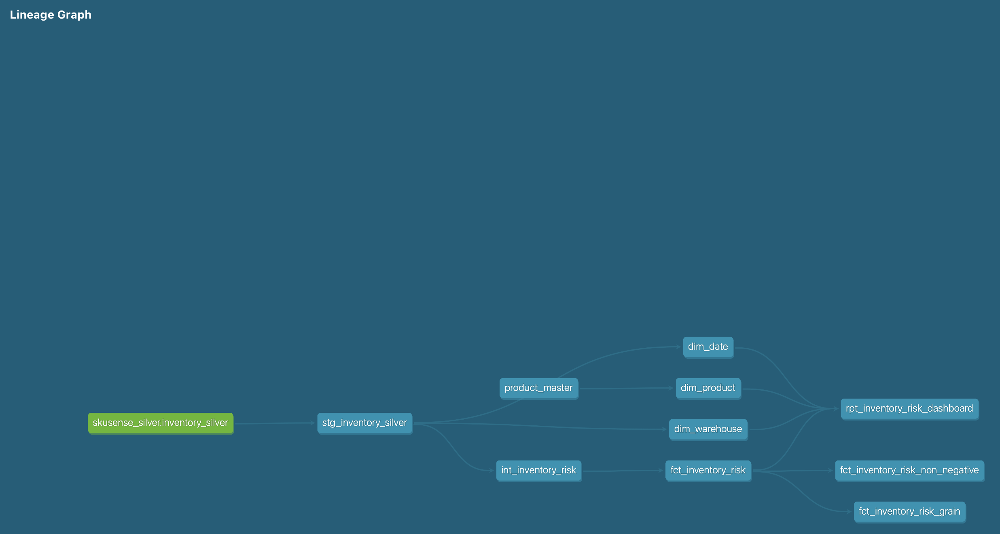

# SkuSense - Inventory Risk Analytics Platform (AWS-Native)

An analytics system that identifies stockout risk across warehouses and supports inventory prioritization decisions.


## 🎯 Problem
Inventory stockouts lead to:
	-	Lost revenue
	-   Poor customer experience
	-   Inefficient replenishment decisions

Most systems track inventory levels but fail to:
	-	Model risk over time
	-	Identify which products need immediate action
	-	Provide warehouse-level visibility

---
## 💡 Solution

SkuSense models inventory as a time-series warehouse dataset, enabling:
	-	Tracking of stockout risk trends over time
	-	Identification of critical and low-stock SKUs
	-	Prioritization of high-risk products
	-	Comparison of risk across warehouses
---

## 🏗️ Architecture (AWS-Native)
### Pipeline Flow

1. **Ingestion**
   - Raw CSV inventory snapshots uploaded to S3

2. **Processing (Glue + Iceberg)**
   - Bronze: cleaned + deduplicated data  
   - Silver: daily inventory snapshot table  

3. **Warehouse Modeling (dbt + Athena)**
   - Star schema built with:
     - `fct_inventory_risk`
     - `dim_product`
     - `dim_warehouse`
     - `dim_date`
   - Business logic implemented in SQL

4. **Consumption Layer (QuickSight)**
   - Dashboard for inventory risk monitoring

---

## 📊 Data Model

### Fact Table

**`fct_inventory_risk`**

**Grain:**
> One row per `snapshot_date`, `product_id`, `warehouse_id`

**Key Metrics:**
- `qty_on_hand`
- `inventory_delta`
- `daily_units_sold_proxy`
- `avg_daily_usage_7d`
- `days_until_stockout`
- `stock_status`
- `reorder_flag`

---

### Dimensions

- `dim_product`
- `dim_warehouse`
- `dim_date`

---

## 📈 Key Metrics

- **Critical SKUs** → products with ≤ 7 days until stockout  
- **Low Stock SKUs** → products with ≤ 14 days until stockout  
- **Warehouses with Critical Risk** → warehouses containing at least one critical SKU  
- **Average Days Until Stockout** → average across latest snapshot  

---

## 🔗 Lineage Graph


## 📊 Dashboard (QuickSight)


### KPI Overview


- Critical SKUs
- Low Stock SKUs
- Warehouses at Risk
- Average Days Until Stockout

### Visualizations

- **Risk Trend Over Time**

  - Tracks number of critical and low-stock SKUs daily

- **Warehouse Risk Distribution**

  - Compares inventory risk across warehouses

- **Top Products at Risk**

  - Highlights products with lowest days until stockout

### Filters
- Warehouse  
- Product Category  
- Date Range  

---


## Case Study: Inventory Risk Analysis
### Scenario
Assuming this dashboard is used by a supply chain team responsible for monitoring inventory health across multiple warehouses.

The goal is to identify which products are at risk of stockout and prioritize replenishment decisions.
---

### Key Observations
- 26 SKUs are in a **Critical state** (<= 7 days until stockout)
- 45 SKUs are in a **Low stock state** (<= 14 days until stockout)
- 4 warehouses currently contain at least one critical SKU
- Average days until stockout across all SKUs is **14 days**
- The number of low stock SKUs remains consistently higher than critical SKUs
- Inventory risk does not significantly decrease over time

This suggests that replenishment is not fully keeping up with ongoing demand.
---

### Root Cause Analysis
The observed risk patterns suggest:
- High turnover products are depleting faster than they are replenished
- Replenishment cycles may be static and not responsive to demand changes
- Inventory distribution across warehouses may be uneven
- Demand variability is not being fully accounted for in current inventory planning

### Recommended Actions
#### Immediate (0-7 days)
- Prioritize replenishment for SKUs with <= 7 days until stockout
- Focus on products with the lowest days remaining to prevent immediate stockouts

#### Short-Term (7-14 days)
- Monitor low-stock SKUs closely to prevent them from becoming critical
- Adjust reorder threshold dynamically based on recent demand trends

#### Warehouse-Level Actions
- Investigate warehouses with consistently higher risk (e.g., WH02)
- Rebalance inventory by transferring stock from lower-risk warehouses if possible

#### Strategic Improvements
- Introduce demand-aware replenishment logic insted of static thresholds
- Incorporate supplier lead times into stockout risk calculations
- Improve forecasting for high-variability products

### Limitations 
- The dataset is synthetic and may not capture real-world anomalies
- Assumes consistent inventory update frequency across all warehouses
- Does not account for external factors such as supplier delays or sudden demand spikes

Overall, the system highlights where inventory decisions should be prioritized, enabling faster response to stockout risks rather than relying on static inventory monitoring.
---

## 🧠 Analytics Logic (dbt)

All business logic is implemented in SQL using dbt:

- Window functions (`LAG`, rolling averages)
- Inventory movement classification
- Risk categorization using thresholds
- Derived KPIs for reporting

---

## ✅ Data Quality

Implemented using dbt tests:

- Grain validation (`snapshot_date + product_id + warehouse_id`)
- Non-null constraints
- Relationship tests between fact and dimensions
- Accepted values for stock status
- Non-negative checks for inventory metrics

---

## 🛠️ Technology Stack

| Layer | Technology |
|------|----------|
| Storage | Amazon S3 |
| Processing | AWS Glue (PySpark) |
| Table Format | Apache Iceberg |
| Catalog | AWS Glue Catalog |
| Query Engine | Amazon Athena |
| Transformation | dbt (dbt-athena) |
| BI | Amazon QuickSight |
| Infrastructure | Terraform |

---

## 🚀 How to Run

### 1. Deploy Infrastructure
```bash
cd infra
terraform init
terraform apply
```

### 2. Upload Sample Data to S3 
aws s3 cp sample_data/ s3://<your-bucket>/raw/ --recursive

### 3. Run the Bronze -> Silver Pipeline 
aws stepfunctions start-execution \
  --state-machine-arn <state-machine-arn> \
  --input '{"BUCKET":"<your-bucket>"}'

### 4. Build the Analytics Layer
cd dbt
dbt run
dbt test

** Query via Athena/Visualize in QuickSight. **
** Connect QuickSight to the modeled Athena tables for Dashboarding **


---
## 📌 Key Learnings
-	Importance of data grain correctness in analytics systems
-	Separation of data processing (Glue) vs business logic (dbt)
-	Building a star schema for BI consumption
-	Implementing data quality checks in analytics pipelines
-	Designing end-to-end analytics workflows on AWS
---
## 🎯 Project Focus
This project demonstrates:
	-	Analytics Engineering (dbt + modeling)
	-	Data Engineering fundamentals (Glue, Iceberg, pipelines)
	-	BI/Reporting (QuickSight dashboard)
	-	End-to-end data product thinking
---

Built By Paruhang Angdembe 


